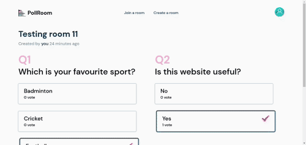
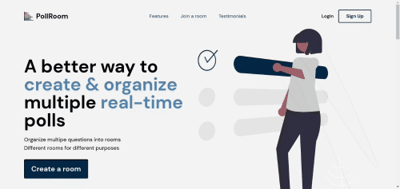

# PollRoom


  

Created this project to learn Typescript and React. This is the front-end/client-side code of the complete application. Back-end/server-side code can be found [here](https://github.com/mukul-pathania/pollroombackend).

**PollRoom** is a simple web app which can be used to create polls. Polls can be a very good way to engage your audience in meetings, webinars or other events.

Pollroom allows you to organise multiple related polls into a room and you can watch the changes to all the polls happen in realtime, rather than seeing a poll at a time.

Users will create rooms with unique name and share the name with everyone they want in the room. Creator of the room can then add polls which will be propagated to all users in realtime who are on the room page.  

  


## Demo



The application can be accessed live at [https://pollroom-six.vercel.app](https://pollroom-six.vercel.app).


## Technologies used

1. [Typescript](https://www.typescriptlang.org/)
2. [Next.js](https://nextjs.org/)
3. [Tailwindcss](https://tailwindcss.com/)
4. [Headless UI](https://headlessui.dev/)
5. [Socket.IO](https://socket.io/)  

## Development

You can clone this repository using git and install all the dependencies to start with development.

```bash
#Clone the repo first
git clone https://github.com/mukul-pathania/pollroom.git

#Install all the dependencies
yarn
```

Then create a file named .env.local with proper values for the keys defined in .env.example, after you have done this we can start the development server.

```bash
#Start the development server
yarn dev
```

You can now open your browser at http://localhost:3000 and should be greeted by the homepage of the application.

You might also need to setup the back-end/server-side of this application for development, instructions for setting that up should be found [here](https://github.com/mukul-pathania/pollroombackend).